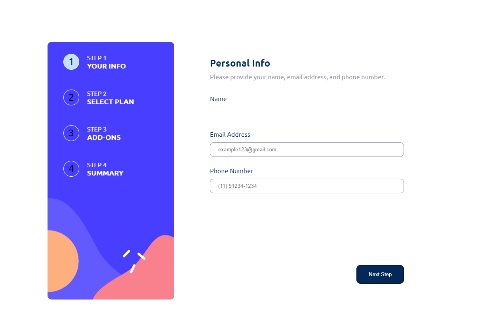

# ![WebApp]
# MultiStepProject
<table>
<tr>
<td>
  Esse projeto é do Frontend Mentor. Onde eu segui o layout, mas fiz o projeto do meu jeito para praticar TypeScript. 
</td>
</tr>
</table>

## Site

### Home
Essa é a Home do projeto, onde o usuário pode colocar algumas de suas informações.

### Seleção de Planos
Essa é a parte de seleção de planos. Onde o usuário pode escolher o plano que melhor se encaixa com suas necessidades, e se será mensal ou anual.

### Adições ao Plano
Essa é a parte em que o usuário pode ou não escolher pacotes adicionais ao seu plano.

### Sumário
Nessa última parte, o usuário poderá revisar todas as informações selecionadas e confirmar ou alterar caso desejado.

## Mobile support
A aplicação web está totalmente responsiva, se adaptando em telas menores e tendo um layout um pouco diferente e ainda bonito.

## Feito usando: 

- [TypeScript](https://www.typescriptlang.org) - TypeScript adds additional syntax to JavaScript to support a tighter integration with your editor. Catch errors early in your editor
- [React](https://react.dev) - The library for web and native user interfaces
- [Vite](https://vitejs.dev) - Next Generation Frontend Tooling
- [Styled-Components](https://styled-components.com) - Styling your way with speed, strong typing, and flexibility.
- [React-router-dom](https://reactrouter.com/en/main) - React Router DOM is an npm package that enables you to implement dynamic routing in a web app. It allows you to display pages and allow users to navigate them. It is a fully-featured client and server-side routing library for React.
- [React-redux](https://react-redux.js.org) - Designed to work with React's component model. You define how to extract the values your component needs from Redux, and your component updates automatically as needed.